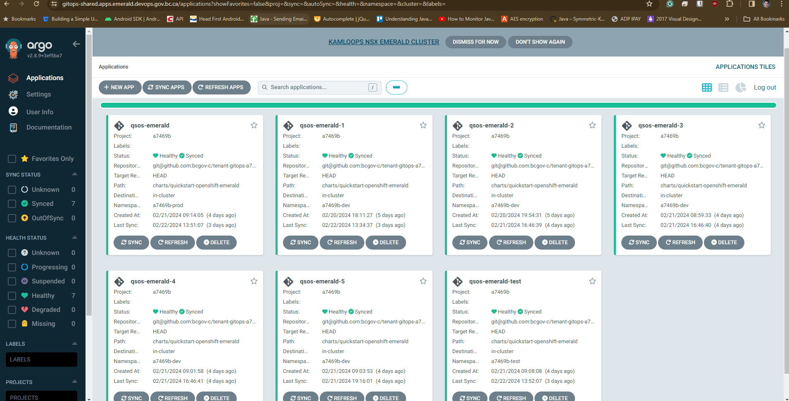

# OpenShift Emerald QuickStart Template for the Justice Sector

## About the Justice Sector

The Justice Sector operates within a framework of heightened sensitivity, handling confidential and critical data such as legal records, court proceedings, and evidence management. This repository is specifically designed to address the unique requirements of deploying applications within the Justice Sector, ensuring compliance with stringent security, privacy, and operational standards. By leveraging the Emerald OpenShift environment, Justice Sector teams can deploy scalable and secure applications while adhering to best practices for managing sensitive data. This repository provides the tools, templates, and guidelines necessary to streamline application deployment and foster collaboration among teams, all while maintaining the integrity and confidentiality of Justice sector operations.

**Key features of this repository include:**

  •	**Sector-Specific Deployment Processes:** Step-by-step guidance for managing deployments in Development, Test, and Production environments, ensuring accountability and traceability.
  
  •	**Enhanced Security Practices:** Focused on protecting sensitive data and meeting compliance requirements, including encryption, access control, and audit logging.

  •	**Streamlined Collaboration:** Clearly defined roles and responsibilities for Vendor Code Reviewers, Product Owners, and the Application Management Team to ensure seamless coordination across deployments.
  
  •	**Best Practices and Templates**: Pre-configured templates and examples tailored to Justice Sector use cases, such as managing secure APIs, integrating legacy systems, and deploying evidence-handling applications.

This repository supports the Justice Sector’s mission to deliver secure, efficient, and innovative digital solutions while upholding public trust and accountability. By following the guidance outlined here, teams can confidently build and deploy applications that meet the highest standards of security and operational excellence.

 ## Justice Sector Deployment Process
 
 In the Justice Sector, a separate Pull Request (PR) is required for each deployment environment:
 
•	One PR for Development (DEV) if the PR has moved to TEST and you are making further changes

•	A new PR for Test (TEST)

•	Another new PR for Production (PROD)

_**Note: **If a PR does not pass testing and requires fixes, the developer can update the existing PR and resubmit it to the Code Reviewer. This approach avoids the need to create a new PR for every fix._

**Example Workflow:**
•	PR1 is submitted to the Code Reviewer.

•	If changes are required, the developer updates PR1 and resubmits it for review.

•	A new PR would only be created if the original PR (e.g., PR1) has already been merged into the PROD environment.

## Coordinated PR Creation for TEST and PROD

For deployments to TEST and PROD, the following roles and responsibilities apply:

**1.	Vendor Code Reviewer/Technical Lead**
   
  o Responsible for creating and submitting the PR for the TEST and PROD environments.

  o	Ensures the PR aligns with technical requirements and includes all necessary updates for the environment.

  o	 Creates a deployment ticket in their JIRA project with the release details.
          - Assigns the ticket to the Application Management Team.
          - Tags the Product Owner (PO) for discussion and approval coordination.

**2.	Product Owner and Application Management Team**

   o	Act as release coordinators for all deployments to TEST and PROD.

   o	Collaborate with the Vendor Code Reviewer/Technical Lead to coordinate deployment timelines, approvals, and any necessary stakeholder communication.

This process ensures that all releases to TEST and PROD are carefully reviewed, documented, and executed in alignment with sector standards.

## Pull Request-Based Workflows with Sample Stack Targeted for Emerald Cluster

### This repository is addon to [QuickStart for OpenShift](https://github.com/bcgov/quickstart-openshift) and is targeted for Emerald Cluster, with some additional features and configurations.

Additional config/features to make Quickstart OpenShift Emerald Cluster Compatible include:
- ArgoCD for GitOps (Since GHA is not open for Emerald, ArgoCD is used to Deploy the application)
- HELM charts for application deployments reside in bcgov-c organization.
- Sample HELM repo which holds the charts for the application deployments [Here](https://github.com/bcgov-c/tenant-gitops-a7469b). 
- Follow this link to see the [ArgoCD Setup](https://docs.developer.gov.bc.ca/argo-cd-usage/)
- Emerald is closed by nature for any traffic, teams must define explicit KNP and Ingress rules to allow traffic to the application.
- Teams must understand Security Constraints when using Emerald Cluster and apply it appropriately to each component. Follow this link(IDIR protected) to learn details around Emerald cluster [Here](https://digital.gov.bc.ca/cloud/services/private/internal-resources/emerald/)

Limitations:
- GitHub Actions is not available for Emerald Cluster, so ArgoCD is used for GitOps.
- Since Argo Depends on pre-defined HELM charts, the PR pipeline is  tweaked with MOD 5 to allow 5 concurrent PRs to be deployed to the cluster.
- ScreenShot below.
- If team needs more, then depending on available resources in the cluster, the MOD can be increased to 10 to do 10 concurrent PR deployments. 
- Currently, the ArgoCD is polling the tenant repos every 3 minutes for changes, so the changes will be reflected in the cluster within 3 to 6 minutes of the PR creation or main merge.
### Resources
This repository is provided by Ministry of Attorney General, Information Systems Branch OpenShift Support Team, courtesy of the Government of British Columbia.

